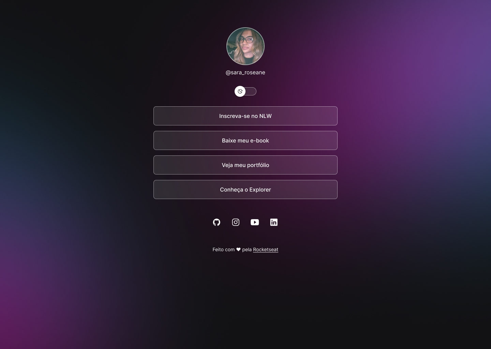

<h1 align='center'>DevLinks</h1>

Programa exclusivo e gratuito, promovido pela Rocketseat para ensino de tecnologia WEB 

 
  <a href='#-tecnologias'>Tecnologias</a>&nbsp;&nbsp;&nbsp;|&nbsp;&nbsp;&nbsp;
  <a href='#-prjeto'>Projeto</a>&nbsp;&nbsp;&nbsp;|&nbsp;&nbsp;&nbsp;
  <a href='#-layout'>Layout</a>&nbsp;&nbsp;&nbsp;|&nbsp;&nbsp;&nbsp;
  <a href='#-memo-linceça'>Licença</a>

  

## Tecnologias

Esse projeto foi desenvolvido com as seguintes tecnologias:

- HTML e CSS
- JavaScript
- Git e Github
- Figma

## Projeto

O DevLinks é um agregador de links para usar como cartão de visitas online

## Layout

Você pode visualziar o layout do projeto através [DESSE LINK](https://www.figma.com/file/T8CJbFvtsM5S6cPb1dtkC9/DevLinks-%E2%80%A2-Projeto-Discover-(Community)?type=design&node-id=58-415&mode=design&t=pVIilmaqF6SlDsVW-0>). É necessário ter conta no [Figma](https://figma.com) para acessá-lo

## :memo: Licença

Esse projeto está sob a licença MIT.
